# **Ojol-Cuanbot Router**

**Ojol-Cuanbot Router** adalah aplikasi web asisten kurir/driver logistik independen untuk mengoptimalkan perjalanan multi-pickup dan multi-drop. Aplikasi ini menggunakan teknologi **Kecerdasan Buatan (AI) Multimodal (Vertex AI Gemini)** untuk membaca screenshot pesanan secara massal dan mengotomatiskan pembuatan rute berkendara terpendek/tercepat menggunakan **Google Maps Routes API V2**.

---

## **1. Alur Sistem (Architecture Flow)**

Aplikasi ini menggunakan alur data terintegrasi dari pengunggahan gambar oleh pengguna hingga visualisasi rute teroptimasi pada peta:

```mermaid
sequenceDiagram
    participant Driver as Driver (Browser)
    participant Server as Backend API (Node.js)
    participant Gemini as Vertex AI Gemini (OCR)
    participant Maps as Google Maps Platform
    
    Driver->>Server: 1. Unggah Screenshot & Posisi GPS (POST /api/extract-address)
    Note over Server: Mengubah buffer gambar menjadi Base64
    Server->>Gemini: 2. Kirim Gambar & Instruksi OCR (gemini-3.1-flash-lite)
    Gemini-->>Server: 3. Kembalikan data alamat terstruktur (JSON Array)
    
    rect rgb(20, 30, 50)
        Note right of Server: Resolusi Koordinat & Optimasi
        Server->>Maps: 4. Resolusi alamat ke koordinat (Geocoding & Places API)
        Server->>Maps: 5. Hitung matriks jarak/waktu (Routes API: computeRouteMatrix)
        Note over Server: Pecahkan TSP (Traveling Salesperson Problem) secara lokal
    end
    
    Server->>Maps: 6. Request rute & polyline final (Routes API: computeRoutes)
    Maps-->>Server: 7. Kirim polyline koordinat terenkripsi
    
    Server-->>Driver: 8. Kembalikan data Rute Optimal (Waypoints, Polyline, Jarak, Waktu)
    Note over Driver: Dekode polyline & menggambar rute di peta
    Driver->>Driver: 9. Tampilkan peta rute & timeline checklist kurir
```



---

## **2. Tumpukan Teknologi (Tech Stack)**

### **Backend (Node.js & Express)**
- **Runtime & Framework**: Node.js dengan Express.js.
- **Google Gen AI SDK**: `@google/genai` untuk memanggil Vertex AI.
- **HTTP Client**: `axios` untuk melakukan request terstruktur ke REST API Google Maps.
- **Multimodal Handler**: `multer` untuk mengelola upload file screenshot gambar di memori.

### **Frontend (React & Vite)**
- **Framework**: React.js di-build menggunakan bundler Vite yang super cepat.
- **Peta Interaktif**: Leaflet.js dengan basemap *CartoDB Dark Matter* untuk visualisasi yang modern.
- **Icons**: `lucide-react` untuk ikon-ikon dasbor premium.
- **Styling**: Vanilla CSS bergaya **Glassmorphism Dark Mode** dengan transparansi pudar, neon glow, dan efek transisi yang interaktif.

### **Layanan Google Cloud Platform (GCP)**
- **Vertex AI (`gemini-3.1-flash-lite`)**: Membaca gambar struk/screenshot pesanan secara massal dan mengidentifikasi entitas alamat pengirim (pickup) dan penerima (delivery).
- **Google Maps Geocoding API**: Mengonversi alamat teks mentah menjadi koordinat bumi (Latitude & Longitude).
- **Google Maps Places API (New)**: Melakukan pencarian berbasis teks untuk mengoreksi dan mengidentifikasi lokasi titik toko/tempat usaha (misal: Indomaret) yang sering kali tidak terdeteksi dengan geocoding biasa.
- **Google Maps Routes API (V2)**:
  - `computeRouteMatrix`: Menghitung matriks jarak dan durasi berkendara dari semua titik koordinat.
  - `computeRoutes`: Menghasilkan detail navigasi lengkap dan polyline jalanan yang sangat presisi.

---

## **3. Fitur Lanjutan (Advanced Features) pada Routes API V2**

Untuk kurir yang menggunakan sepeda motor di Indonesia, aplikasi telah mengaktifkan parameter tingkat lanjut pada Routes API V2:

1. **Pencegahan Jalan Tol & Jalan Layang Mobil (`avoidTolls: true` & `avoidHighways: true`)**:
   Menghindari jalan tol khusus mobil dan jalan layang non-tol (JLNT) yang terlarang bagi roda dua di Indonesia, menjaga keselamatan dan keselamatan berkendara kurir.
2. **Kualitas Visual Mulus (`polylineQuality: "HIGH_QUALITY"`)**:
   Memaksa Google Maps mengembalikan garis rute dengan titik koordinat rapat. Garis rute di peta frontend akan tampak mulus mengikuti kelokan jalan raya tanpa terpotong patah-patah.
3. **Prakiraan Lalu Lintas Real-time (`routingPreference: "TRAFFIC_AWARE_OPTIMAL"`)**:
   Menghitung rute tercepat berdasarkan data kemacetan lalu lintas terbaru saat kurir siap berangkat.
   *   **Penanganan Batasan API (Mitigasi)**: Sesuai dokumentasi resmi, `TRAFFIC_AWARE_OPTIMAL` membatasi ukuran matriks maksimal 100 elemen (jumlah titik $\times$ tujuan $\le 100$). Kode backend mendeteksi hal ini secara dinamis: jika jumlah titik $\le 10$ ($10 \times 10 = 100$), sistem menggunakan `TRAFFIC_AWARE_OPTIMAL`. Jika $> 10$ titik, sistem otomatis beralih ke `TRAFFIC_AWARE` untuk mencegah error payload sambil tetap mempertahankan optimasi lalu lintas yang didukung.

---

## **4. Struktur Proyek**

```
driver-maps/
├── backend/
│   ├── services/
│   │   ├── agent.js        # Vertex AI Gemini OCR Integrator
│   │   └── maps.js         # Google Maps (Geocoding, Places, Routes API V2)
│   ├── index.js            # Express API Routes & Server Entrypoint
│   ├── test.js             # Skrip Verifikasi Pengujian API Lokal
│   ├── package.json
│   └── .env
├── frontend/
│   ├── src/
│   │   ├── assets/         # Aset Gambar/SVG
│   │   ├── components/
│   │   │   └── MapComponent.jsx  # Render Map Leaflet & Custom Marker/Animasi Polyline
│   │   ├── utils/
│   │   │   └── polyline.js # Dekoder Polyline Encoded Google
│   │   ├── App.jsx         # Layout Utama & Dashboard Simulator Posisi Driver
│   │   ├── App.css         # Styling Glassmorphism Dark Mode
│   │   └── main.jsx
│   ├── index.html
│   ├── package.json
│   └── vite.config.js
└── PRD - Multi-Pickup & Multi-Drop Router App.md
```

---

## **5. Kontrak API Utama**

### **POST `/api/extract-address`**
Mengunggah screenshot pesanan kurir secara massal dan mengembalikan koordinat serta rute teroptimasi.

- **Request Body (Multipart Form-Data)**:
  - `screenshots` (File Array): File gambar screenshot pesanan kurir (maksimal 5).
  - `driver_lat` (String, Opsional): Koordinat lintang posisi GPS kurir saat ini.
  - `driver_lng` (String, Opsional): Koordinat bujur posisi GPS kurir saat ini.

- **Response (JSON)**:
  ```json
  {
    "success": true,
    "data": [
      {
        "pickup": { "name": "Indomaret", "address": "Jl. Raden Fatah..." },
        "delivery": { "name": "Budi", "address": "Kost Peladen..." }
      }
    ],
    "routes": {
      "geocoding": {
        "optimized_waypoints": [
          { "type": "driver", "name": "Driver Position", "coordinates": { "lat": -6.16, "lng": 106.75 } },
          { "type": "pickup", "name": "Indomaret", "coordinates": { "lat": -6.22, "lng": 106.70 } },
          { "type": "delivery", "name": "Budi", "coordinates": { "lat": -6.27, "lng": 106.73 } }
        ],
        "route_details": {
          "distanceMeters": 21107,
          "duration": "2505s",
          "polyline": { "encodedPolyline": "ferd@mtpjS..." }
        },
        "navigation_link": "https://www.google.com/maps/dir/?api=1&origin=..."
      },
      "places": { ... }
    }
  }
  ```

---

## **6. Cara Memulai & Menjalankan Lokal**

### **Langkah 1: Setup Kredensial & Environment**

1. Buat berkas `.env` di dalam folder `backend/`:
   ```env
   PORT=8080
   GOOGLE_MAPS_API_KEY=KUNCI_API_GOOGLE_MAPS_ANDA
   PROJECT_ID=ID_PROYEK_GOOGLE_CLOUD_ANDA
   LOCATION=us-central1
   ```
2. Pastikan Anda telah melakukan login kredensial Google Cloud di perangkat lokal Anda (`gcloud auth application-default login`) atau meletakkan Service Account Key jika diperlukan.

### **Langkah 2: Menjalankan Backend**

```bash
cd backend
npm install
node index.js
```
Server backend akan mulai berjalan di [http://localhost:8080](http://localhost:8080).

### **Langkah 3: Menjalankan Uji Coba API (CLI)**

Anda dapat menguji proses ekstraksi & perutean alamat langsung dari CLI menggunakan gambar tangkapan layar sampel:

```bash
cd backend
node test.js ./jalur/ke/gambar_screenshot.jpg
```

### **Langkah 4: Menjalankan Frontend**

```bash
cd ../frontend
npm install
npm run dev
```
Aplikasi web visualisasi kurir akan siap dibuka melalui browser di [http://localhost:5173](http://localhost:5173).
