# **Ojol-Cuanbot Router**

**Ojol-Cuanbot Router** adalah aplikasi web asisten kurir/driver logistik independen untuk mengoptimalkan perjalanan multi-pickup dan multi-drop. Aplikasi ini menggunakan teknologi **Kecerdasan Buatan (AI) Multimodal (Vertex AI Gemini)** untuk membaca screenshot pesanan secara massal dan mengotomatiskan pembuatan rute berkendara terpendek/tercepat menggunakan **Google Maps Routes API V2**.

---

## **1. Alur Sistem (Architecture Flow)**

Aplikasi ini menggunakan alur data terintegrasi dari pengunggahan gambar oleh pengguna hingga visualisasi rute teroptimasi pada peta:

```mermaid
sequenceDiagram
    participant Driver as Driver (Browser)
    participant Server as Backend API (Node.js)
    participant Cache as Firestore Cache
    participant Gemini as Vertex AI Gemini (OCR)
    participant Maps as Google Maps Platform
    
    Driver->>Server: 1. Unggah Screenshot & Posisi GPS (POST /api/extract-address)
    Note over Server: Mengubah buffer gambar menjadi Base64
    Server->>Gemini: 2. Kirim Gambar & Instruksi OCR (Gemini Multimodal)
    Gemini-->>Server: 3. Kembalikan data alamat terstruktur (JSON Array)
    
    rect rgb(20, 30, 50)
        Note right of Server: Resolusi Koordinat & Optimasi
        Server->>Cache: 4. Cek cache alamat (Geocoding/Places)
        Cache-->>Server: Kembalikan koordinat tercache (jika ada)
        Server->>Maps: 5. Resolusi alamat ke koordinat (Geocoding & Places API)
        Server->>Maps: 6. Hitung matriks jarak/waktu (Routes API: computeRouteMatrix)
        Note over Server: Pecahkan TSP (Hybrid: Brute-force ≤3 order, Greedy+2-Opt >3 order)
    end
    
    Server->>Maps: 7. Request rute & polyline final (Routes API: computeRoutes)
    Maps-->>Server: 8. Kirim polyline koordinat terenkripsi
    
    Server-->>Driver: 9. Kembalikan data Rute Optimal + Order Gagal (jika ada)
    Note over Driver: Dekode polyline & menggambar rute di peta
    Driver->>Driver: 10. Tampilkan peta rute, timeline & notifikasi order gagal
```



---

## **2. Tumpukan Teknologi (Tech Stack)**

### **Backend (Node.js & Express)**
- **Runtime & Framework**: Node.js dengan Express.js.
- **Google Gen AI SDK**: `@google/genai` untuk memanggil Vertex AI.
- **HTTP Client**: `axios` untuk melakukan request terstruktur ke REST API Google Maps.
- **Multimodal Handler**: `multer` untuk mengelola upload file screenshot gambar di memori.
- **Caching**: **Firestore** (`@google-cloud/firestore`) untuk cache hasil geocoding dengan TTL (Time-To-Live) 30 hari.

### **Frontend (React & Vite)**
- **Framework**: React.js di-build menggunakan bundler Vite yang super cepat.
- **Peta Interaktif**: Leaflet.js dengan basemap *CartoDB Dark Matter* untuk visualisasi yang modern.
- **Icons**: `lucide-react` untuk ikon-ikon dasbor premium.
- **Styling**: Vanilla CSS bergaya **Glassmorphism Dark Mode** dengan transparansi pudar, neon glow, dan efek transisi yang interaktif.

### **Layanan Google Cloud Platform (GCP)**
- **Vertex AI (Gemini Multimodal)**: Membaca gambar struk/screenshot pesanan secara massal dan mengidentifikasi entitas alamat pengirim (pickup) dan penerima (delivery). Model dapat dikonfigurasi via environment variable `GEMINI_MODEL` (default: `gemini-3.1-flash-lite`).
- **Google Maps Geocoding API**: Mengonversi alamat teks mentah menjadi koordinat bumi (Latitude & Longitude).
- **Google Maps Places API (New)**: Melakukan pencarian berbasis teks untuk mengoreksi dan mengidentifikasi lokasi titik toko/tempat usaha (misal: Indomaret) yang sering kali tidak terdeteksi dengan geocoding biasa.
- **Google Maps Routes API (V2)**:
  - `computeRouteMatrix`: Menghitung matriks jarak dan durasi berkendara dari semua titik koordinat.
  - `computeRoutes`: Menghasilkan detail navigasi lengkap dan polyline jalanan yang sangat presisi.

---

## **3. Fitur Lanjutan (Advanced Features)**

### **3.1. Hybrid TSP Solver with 2-Opt (Pickup-All-First)**
Berdasarkan riset lapangan, norma operasional driver adalah **mengambil semua pickup terlebih dahulu, baru mengantar semua delivery**. Oleh karena itu, solver dirancang sebagai hybrid yang memastikan constraint pickup-before-delivery selalu terpenuhi:

- **≤3 order**: Brute-force semua permutasi yang valid (maks. 720 permutasi) — menemukan **global optimal**.
- **>3 order**: **Greedy Nearest Neighbor** untuk solusi awal, dilanjutkan **2-opt local search** untuk menghilangkan *crossing edges* dan memperbaiki rute yang terlalu diputar. Kompleksitas O(N²) per iterasi, sangat cepat untuk 4–6 order.
- **Matriks jarak**: Menggunakan **Haversine distance matrix** (great-circle) dengan estimasi kecepatan 30 km/h. Tidak perlu panggil `computeRouteMatrix` saat solving — sangat cepat, tidak terbatas quota API, dan tidak ada data hilang.

### **3.2. Throttling Geocoding (Anti-Quota Burn)**
Proses geocoding dibatasi maksimal **3 order paralel per API type** menggunakan `asyncPool`. Pickup dan delivery dalam satu order tetap diproses paralel via `Promise.all`. Ini mencegah pembakaran quota Google Maps API yang terlalu cepat saat banyak order diupload bersamaan.

### **3.3. Parameter Tingkat Lanjut Routes API V2**
Untuk kurir yang menggunakan sepeda motor di Indonesia, aplikasi telah mengaktifkan parameter tingkat lanjut:

1. **Pencegahan Jalan Tol & Jalan Layang Mobil (`avoidTolls: true` & `avoidHighways: true`)**:
   Menghindari jalan tol khusus mobil dan jalan layang non-tol (JLNT) yang terlarang bagi roda dua di Indonesia, menjaga keselamatan berkendara kurir.
2. **Kualitas Visual Mulus (`polylineQuality: "HIGH_QUALITY"`)**:
   Memaksa Google Maps mengembalikan garis rute dengan titik koordinat rapat. Garis rute di peta frontend akan tampak mulus mengikuti kelokan jalan raya tanpa terpotong patah-patah.
3. **Prakiraan Lalu Lintas Real-time (`routingPreference: "TRAFFIC_AWARE_OPTIMAL"`)**:
   Menghitung rute tercepat berdasarkan data kemacetan lalu lintas terbaru saat kurir siap berangkat.
   *   **Penanganan Batasan API (Mitigasi)**: Sesuai dokumentasi resmi, `TRAFFIC_AWARE_OPTIMAL` membatasi ukuran matriks maksimal 100 elemen (jumlah titik $\times$ tujuan $\le 100$). Kode backend mendeteksi hal ini secara dinamis: jika jumlah titik $\le 10$ ($10 \times 10 = 100$), sistem menggunakan `TRAFFIC_AWARE_OPTIMAL`. Jika $> 10$ titik, sistem otomatis beralih ke `TRAFFIC_AWARE` untuk mencegah error payload sambil tetap mempertahankan optimasi lalu lintas yang didukung.

---

## **4. Struktur Proyek**

```
driver-maps/
├── backend/
│   ├── services/
│   │   ├── agent.js        # Vertex AI Gemini OCR Integrator
│   │   ├── maps.js         # Google Maps (Geocoding, Places, Routes API V2) & Hybrid TSP Solver
│   │   └── cache.js        # Firestore Address Cache dengan TTL
│   ├── index.js            # Express API Routes, Throttling & Server Entrypoint
│   ├── test.js             # Skrip Verifikasi Pengujian API Lokal
│   ├── package.json
│   └── .env
├── frontend/
│   ├── src/
│   │   ├── assets/         # Aset Gambar/SVG
│   │   ├── components/
│   │   │   └── MapComponent.jsx  # Render Map Leaflet & Custom Marker/Animasi Polyline
│   │   ├── utils/
│   │   │   ├── imageCompress.js  # Kompresi Gambar Client-side (Canvas)
│   │   │   └── polyline.js     # Dekoder Polyline Encoded Google
│   │   ├── App.jsx         # Layout Utama, Upload Manager & Dashboard
│   │   ├── App.css         # Styling Glassmorphism Dark Mode
│   │   └── main.jsx
│   ├── index.html
│   ├── package.json
│   └── vite.config.js
└── PRD - Multi-Pickup & Multi-Drop Router App.md
```

---

## **5. Kontrak API Utama**

### **POST `/api/extract-address`**
Mengunggah screenshot pesanan kurir secara massal dan mengembalikan koordinat serta rute teroptimasi.

- **Request Body (Multipart Form-Data)**:
  - `screenshots` (File Array): File gambar screenshot pesanan kurir (maksimal 5).
  - `driver_lat` (String, Opsional): Koordinat lintang posisi GPS kurir saat ini.
  - `driver_lng` (String, Opsional): Koordinat bujur posisi GPS kurir saat ini.

- **Response (JSON)**:
  ```json
  {
    "success": true,
    "data": [
      {
        "pickup": { "name": "Indomaret", "address": "Jl. Raden Fatah..." },
        "delivery": { "name": "Budi", "address": "Kost Peladen..." }
      }
    ],
    "routes": {
      "geocoding": {
        "optimized_waypoints": [
          { "type": "driver", "name": "Driver Position", "coordinates": { "lat": -6.16, "lng": 106.75 } },
          { "type": "pickup", "name": "Indomaret", "coordinates": { "lat": -6.22, "lng": 106.70 } },
          { "type": "delivery", "name": "Budi", "coordinates": { "lat": -6.27, "lng": 106.73 } }
        ],
        "route_details": {
          "distanceMeters": 21107,
          "duration": "2505s",
          "polyline": { "encodedPolyline": "ferd@mtpjS..." }
        },
        "navigation_link": "https://www.google.com/maps/dir/?api=1&origin=...",
        "failed_orders": []
      },
      "places": { ... }
    },
    "failed_orders": [
      { "name": "Warung Pak Slamet", "address": "Jl. Mawar No. 5", "reason": "Gagal mendapatkan koordinat alamat." }
    ]
  }
  ```
  
  > **Catatan**: Field `failed_orders` hanya muncul jika ada order yang gagal diresolve ke koordinat (misal: alamat tidak jelas, tidak ditemukan di Google Maps, atau quota limit). UI frontend menampilkan toast error menyebutkan nama seller yang gagal diproses.

---

## **6. Catatan Teknis & Optimasi (Technical Notes & Optimizations)**

Selama pengembangan dan pengujian, beberapa penyesuaian arsitektur penting dilakukan untuk menjaga kestabilan, kinerja, dan pengalaman pengguna:

### **6.1. Hybrid TSP Solver with 2-Opt**
* **Masalah:** Solver TSP brute-force untuk semua titik (pickup+delivery campur) memiliki kompleksitas $(2N)!$. Untuk 6 order (12 titik + 1 driver = 13 titik), permutasi yang dihasilkan adalah $12! \approx 479$ juta — impossible di Node.js single-thread.
* **Solusi:** Implementasi **hybrid solver** yang mematuhi constraint pickup-before-delivery:
  - **≤3 order**: Brute-force semua permutasi valid (maks. 720 permutasi) — menemukan **global optimal**.
  - **>3 order**: **Greedy Nearest Neighbor** untuk solusi awal yang valid, dilanjutkan **2-opt local search** untuk menghilangkan *crossing edges* dan memperbaiki rute yang terlalu diputar.
  - **2-opt**: Mencoba membalik segmen rute dan menerima kalau hasilnya lebih pendek DAN tetap valid (pickup sebelum delivery). Berulang sampai tidak ada improvement.
  - **Matriks jarak**: Menggunakan Haversine distance matrix — tidak perlu API call saat solving, sehingga sangat cepat dan tidak terbatas quota.

### **6.2. Throttling Geocoding (Anti-Quota Burn)**
* **Masalah:** Endpoint `/api/extract-address` menjalankan Geocoding API dan Places API secara paralel. Untuk 5 order, masing-masing API harus resolve 10 alamat (pickup+delivery), menghasilkan 20 API call sekaligus. Ini mudah memicu rate limit atau membakar quota Google Maps API.
* **Solusi:** Ditambahkan helper `asyncPool(concurrency, items, fn)` yang membatasi maksimal **3 order diproses paralel per API type**. Dalam 1 order, pickup & delivery diresolve paralel via `Promise.all`. Total burst berkurang dari 20 call menjadi 6 call, jauh lebih aman untuk quota.

### **6.3. Tracking Order Gagal (Failed Orders)**
* **Masalah:** Jika satu atau beberapa alamat gagal di-geocode (tidak ditemukan di Google Maps), order tersebut dibuang tanpa notifikasi. User tidak tahu kenapa jumlah order berkurang di hasil rute.
* **Solusi:** `calculateRouteForAPI` sekarang mengumpulkan `failed_orders` array. Response API menggabungkan (merge + deduplicate) failed orders dari kedua API (Geocoding & Places). Frontend menampilkan toast error Bahasa Indonesia: *"Beberapa alamat tidak dapat diproses: [Nama Toko], [Nama Lain]. Periksa kembali alamat pada screenshot."*

### **6.4. Firestore Cache dengan TTL**
* **Masalah:** Setiap request ke `/api/extract-address` akan selalu memanggil Google Maps API untuk alamat yang sama, bahkan jika user upload screenshot berulang-ulang untuk alamat yang sudah pernah diresolve.
* **Solusi:** Ditambahkan layer caching menggunakan **Firestore** (`backend/services/cache.js`). Setiap hasil geocoding/places disimpan dengan TTL 30 hari (`CACHE_TTL_DAYS`). Sebelum memanggil API, sistem mengecek cache terlebih dahulu. Hit count di-increment dengan `await` dan `try/catch` untuk menghindari race condition.

### **6.5. Defensive NDJSON Parsing (computeRouteMatrix)**
* **Masalah:** Google Routes API `computeRouteMatrix` v2 dapat mengembalikan response dalam format **NDJSON (newline-delimited JSON)** tergantung konteks streaming. Axios dengan `responseType: 'json'` mungkin gagal parse string NDJSON.
* **Solusi:** Ditambahkan defensive parsing: jika `response.data` bertipe `string`, split per baris dan parse setiap baris sebagai JSON object. Jika parse gagal, fallback ke null dan gunakan Haversine distance matrix.

### **6.6. Frontend Duration Parsing (Routes API V2 Object)**
* **Masalah:** Google Routes API V2 mengembalikan `duration` dalam dua format: string `"120s"` atau object `{ seconds: 120, nanos: 0 }`. Frontend hanya handle string, sehingga waktu tempuh selalu muncul `N/A` kalau API return object.
* **Solusi:** `formatDuration` di `App.jsx` sekarang handle ketiga format: `string`, `number`, dan `object {seconds, nanos}`.

### **6.7. UI Upload Improvements**
* **Thumbnail Preview**: Setiap file yang diupload menampilkan gambar thumbnail mini (48×48px) menggunakan `URL.createObjectURL`, sehingga user bisa memverifikasi screenshot yang benar sebelum submit.
* **Drag & Drop**: Upload zone mendukung drag & drop dengan visual feedback (border glow cyan, icon berubah, teks berubah saat file di-drag ke atas area).
* **Per-File Compression Status**: Setelah kompresi selesai, setiap file menampilkan badge status — 🟢 **"Dikompresi"** (jika file di-resize/re-compress) atau ⚪ **"Dilewati"** (jika file < 500KB, tidak perlu kompresi). Badge menampilkan before/after size delta per file.

### **6.8. Optimasi Peta Web Leaflet (Kinerja Mobile)**
* **Masalah:** Penayangan label teks kustom (tooltip) melayang secara permanen di atas pin peta Leaflet menyebabkan beban rendering (paint/layout overhead) yang sangat tinggi di peramban web mobile, mengakibatkan animasi terputus-putus (*lag*).
* **Solusi:** Label teks permanen dihilangkan dari DOM pohon komponen [MapComponent.jsx](file:///home/bod/Development/driver-maps/frontend/src/components/MapComponent.jsx). Sebagai gantinya, peta menampilkan penanda nomor pin sederhana (P1, D1, dst.), dan rincian lengkap lokasi (nama & alamat) dapat diakses secara dinamis (*on-demand*) melalui balon popup bawaan Leaflet saat driver mengetuk/klik pin tersebut.

### **6.9. Strategi Pengalihan Google Maps yang Tangguh (Robust Redirection)**
* **Masalah:** Aplikasi Google Maps Mobile akan membatalkan rangkaian rute multi-stop jika salah satu parameter pemberhentian berupa string pencarian kustom (misalnya mengandung teks `[Pickup #1]`) gagal diselesaikan oleh mesin pencari Google Maps. Hal ini menyebabkan rute terpotong hanya menampilkan rute driver ke tujuan pertama saja.
* **Solusi:** URL navigasi menggunakan **koordinat lintang/bujur mentah (`lat,lng`)** sebagai parameter pencarian utama (`destination` dan `waypoints`). Karena koordinat mentah 100% selalu valid dan dapat dipetakan langsung oleh aplikasi Google Maps, rute tidak akan pernah terputus. Parameter `place_id` (jika tersedia) dikirimkan sebagai parameter sekunder opsional agar aplikasi Google Maps menampilkan nama resmi tempat/bisnis pada daftar pemberhentian (*itinerary sheet*) jika terdaftar di database mereka.

---

## **7. Cara Memulai & Menjalankan Lokal**

### **Langkah 1: Setup Kredensial & Environment**

1. Buat berkas `.env` di dalam folder `backend/`:
   ```env
   PORT=8080
   GOOGLE_MAPS_API_KEY=KUNCI_API_GOOGLE_MAPS_ANDA
   PROJECT_ID=ID_PROYEK_GOOGLE_CLOUD_ANDA
   LOCATION=us-central1
   GEMINI_MODEL=gemini-3.1-flash-lite
   CACHE_TTL_DAYS=30
   ```
   > **Catatan**: `GEMINI_MODEL` bersifat opsional (default: `gemini-3.1-flash-lite`). `CACHE_TTL_DAYS` juga opsional (default: 30 hari).
2. Pastikan Anda telah melakukan login kredensial Google Cloud di perangkat lokal Anda (`gcloud auth application-default login`) atau meletakkan Service Account Key jika diperlukan.

### **Langkah 2: Menjalankan Backend**

```bash
cd backend
npm install
node index.js
```
Server backend akan mulai berjalan di [http://localhost:8080](http://localhost:8080).

### **Langkah 3: Menjalankan Uji Coba API (CLI)**

Anda dapat menguji proses ekstraksi & perutean alamat langsung dari CLI menggunakan gambar tangkapan layar sampel:

```bash
cd backend
node test.js ./jalur/ke/gambar_screenshot.jpg
```

### **Langkah 4: Menjalankan Frontend**

```bash
cd ../frontend
npm install
npm run dev
```
Aplikasi web visualisasi kurir akan siap dibuka melalui browser di [http://localhost:5173](http://localhost:5173).
